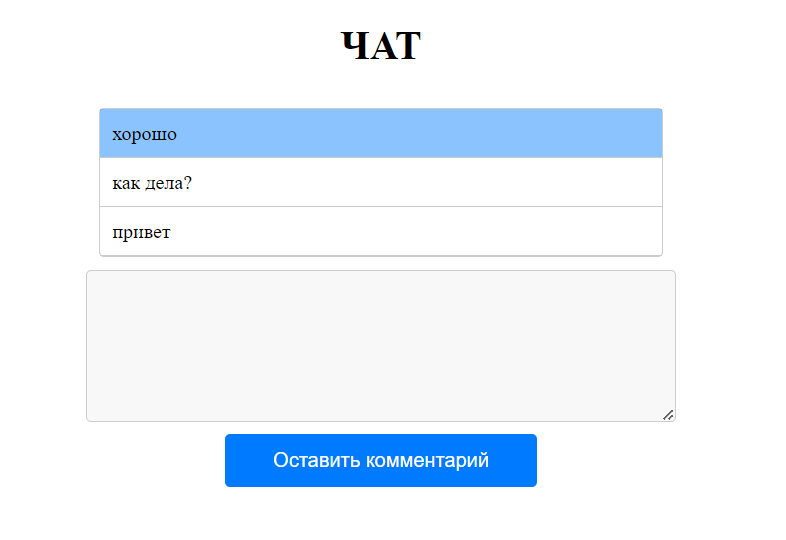

# React Comments App

This is a simple React application that allows users to add comments. Comments are added to the top of the list, and new comments are highlighted. 
The application also includes a spam filter that obscures unwanted words in the comments.

## Technologies

React.js

## Installation
To run the project locally, follow the steps below:

Clone the repository:.\
1.git clone https://github.com/your-username/react-comments-app.git
### `cd react-comments-app`

2.Install the dependencies:
### `npm install`

3.Run the project:
### `npm start`

Open [http://localhost:3000](http://localhost:3000) to view it in your browser.

# Features
Add new comments.\
Highlight new comments.\
Spam filter to obscure unwanted words.
